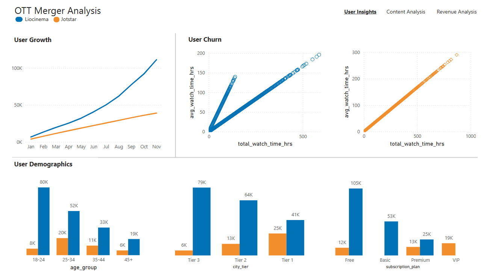
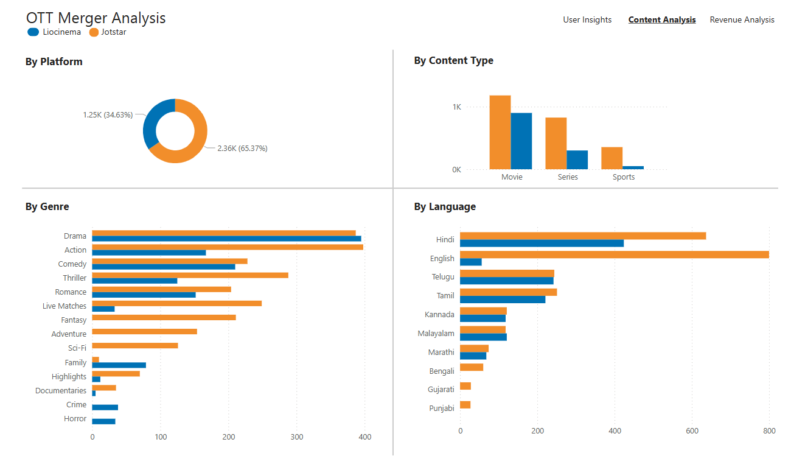
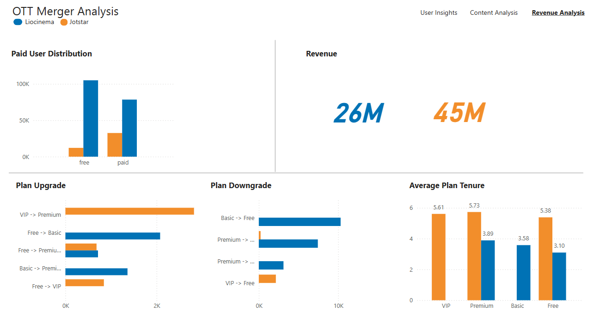

# Challenge #14: Provide Insights for a Strategic Merger in the OTT Domain

## Problem Statment
**Domain: Telecom & Streaming Services**
**Function: Strategy & Operations**  

Lio, a leading telecommunications provider in India, is planning a strategic merger with Jotstar, one of the country’s most prominent streaming platforms. This potential partnership aims to combine **LioCinema’s expansive subscriber base** and **Jotstar’s diverse content library** to revolutionize digital streaming in India.  

### Objective
As part of the merger preparation, the management team at Lio wants to analyze the performance and user behavior of both platforms—**LioCinema and Jotstar**—over the past year (**January to November 2024**). The goal is to gain insights into individual platform performance, **content consumption patterns, subscriber growth, inactivity behavior, upgrade and downgrade trends**. The insights derived from this study will help the management make informed decisions and optimize content strategies post-merger, with the ultimate goal of establishing **Lio-Jotstar as the leading OTT platform in India**.  

### Role & Responsibilities
You are **Peter Pandey**, the data analyst at Lio, tasked with analyzing the data and providing insights.  

### Key Analysis Areas:
1. **Content Library Analysis**: A detailed comparison of content types across both platforms.  
2. **Subscriber Insights**: Analyze trends in subscriber acquisition and demographic variations.  
3. **Inactivity Analysis**: Patterns of inactivity across age groups, city tiers, and subscription plans.  
4. **Upgrade Patterns**: Insights into subscription upgrades and their influencing factors.  
5. **Downgrade Patterns**: Analysis of subscription downgrades and associated trends.  
6. **Content Consumption Behavior**: Patterns in total watch time, device preferences, and variations by user demographics. 

## Dashboard




## Links
Youtube 
```
https://youtu.be/X-8Pcm-cxYY
```

NovyPro
```
https://project.novypro.com/LuQmaX
```